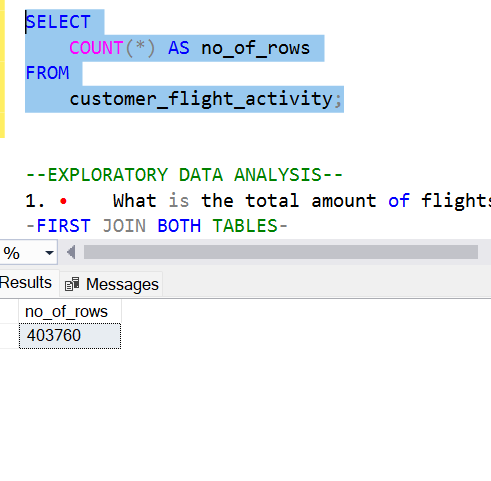
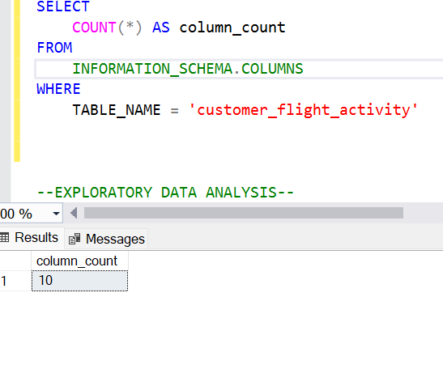
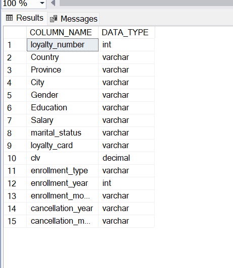
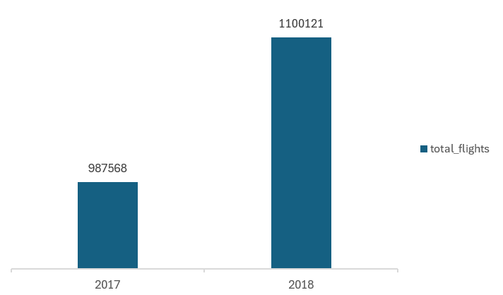
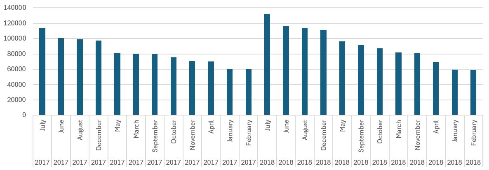
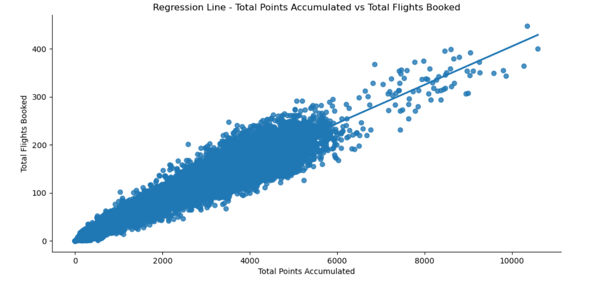
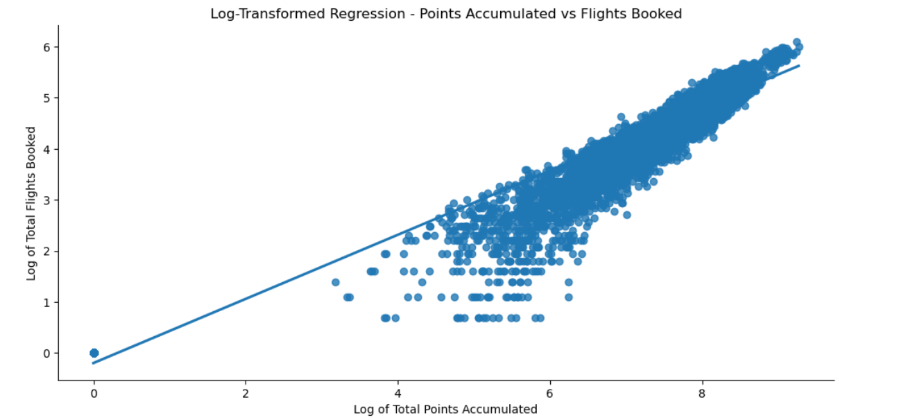

# Analyzing the Impact of Airline Loyalty Campaign Programs on Flight Bookings

## Table of contents 
- [Executive Summary](#executive-summary)
  	- [Objectives](#objectives)
- [Data Source](#data-source)
- [Methodology](#methodology)
	- [Stages](#stages)
	- [Tools](#tools)
- [Development](#development)  
- [Pseudocode](#pseudocode)
 	 - [Data Exploration](#data-exploration)
  	- [Data Cleaning](#data-cleaning)
  - [Transform the Data](#transform-the-data)- [Testing](#testing)
 	 - [Data Quality Tests](#data-quality-tests)
- [Analysis](#analysis)
  - [Exploratory Data Analysis](#exploratory-data-analysis)
 	 - [Findings](#findings) 
- [Recommendations](#recommendations)
- [Feasibility](#feasibility)


## Executive Summary

This project investigates the influence of airline loyalty program on flight bookings and customer churn. By employing data analytics techniques, we aim to understand how this program affect customer behaviour and flight sales. The analysis will provide actionable insights to enhance customer loyalty, and boost airline revenues.

## Objectives
1.	Identify Patterns and Trends: Uncover patterns in customer booking behaviour influenced by various promotions.
2.	 Evaluate Customer Churn: Measure changes in customer churn  attributable to booking behaviour.
3.	Segment Analysis: Segment the customer base to identify which groups respond most positively to loyalty program , based on booking behaviour characteristics.
4.	Provide Recommendations: Offer data-driven recommendations to enhance the for improved effectiveness and customer retention.


## Data Source
- What data is needed to achieve our objective?
We need data on the Impact of Adventure Works Airlines’ Loyalty Campaign Programs on Flight Bookings that includes customer’s:
-	Customer Lifetime Value,
-	Enrolment Type,
-	Cancellation Year,
-	Cancellation Month
-	Total Flights Booked,
-	Distance,
-	Points Accumulated,
-	Points Redeemed,
-	Dollar Cost  Points  Redeemed 

 Where is the data coming from? 
The data is sourced from Kaggle (an Excel extract), [see here to find it.]([www.kaggle.com/datasets/bhavyadhingra00020/top-100-social-media-influencers-2024-countrywise?resource=download](https://www.kaggle.com/datasets/agungpambudi/airline-loyalty-campaign-program-impact-on-flights)). The tpes of data involved are structured and quantitative.

## Methodology
Regression Analysis was used to see the correlation between flights booked and points redeemed.

### Stages
- Developement
- Testing
- Analysis

### Tools 
| Tool | Purpose |
| --- | --- |
| Excel | Exploring the data |
| SQL Server | Cleaning, testing, and analyzing the data |
| Power BI | Visualizing the data via interactive dashboards |
| GitHub | Hosting the project documentation and version control |

## Development

### Pseudocode

- What's the general approach in creating this solution from start to finish?

1. Get the data
2. Explore the data in Excel
3. Load the data into SQL Server
4. Clean the data with SQL
5. Test the data with SQL
6. Visualize the data in Power BI
7. Generate the findings based on the insights
8. Write the documentation + commentary
9. Publish the data to GitHub Pages

### Observations
1.	There are two separate tables with containing important information. This means both tables must be merged to meet our objective
2.	The Column ‘Country’ only contains ‘Canada’
3.	There are at least 6 columns that contain the data we need for this analysis, indicating we have the necessary information needed without needing to contact the client for any more data
4.	Column Salary has 25% missing values,  Columns Cancellation Year and Cancellation Month has 87% missing values.
5.	Within the customer flight activity dataset  0.4% of rows are duplicates.
6.	The months in both datasets are integers and not characters
7.	We have more data than we need, so some of these columns would need to be removed

### Data Cleaning
The cleaned data should meet the following criteria and constraints:
- Only relevant columns should be retained.
- All data types should be appropriate for the contents of each column.
- No column should contain null values, indicating complete data for all records.
- No rows should contain duplicate values
#### Steps to clean and shape the data into the desired format
1.	Remove unnecessary columns by only selecting the ones you need e.g postal_code and Country 
2.	Remove duplicate data within the customer flight activity dataset
3.	Replace missing values with 0 where Salary, cancellation_year and cancellation_month are null
4.	Replace the month number with the name of the month
5.	Replace 0 with ‘Active’ in cancellation_year and cancellation_month to show customer has not cancelled
6.	Change data type of months, cancellation_month and enrolment_month from integers to characters
7.	Make loyalty_number in customer flight activity a foreign key
#### Dataset information
Below is a table outlining the constraints on our cleaned customer flight activity dataset:
| Property | Description |
| --- | --- |
| Number of Rows | 403, 760 |
| Number of Columns | 10 |

Below is a table outlining the constraints on our cleaned customer loyalty history dataset:
| Property | Description |
| --- | --- |
| Number of Rows | 16, 737 |
| Number of Columns | 15 |

#### Tabular representation of the expected schema for the customer loyalty history data:
| Column Name | Data Type | Nullable | Key |
| --- | --- | --- | --- |
| loyalty_number | INTEGER | NO | PRIMARY KEY
| Country | VARCHAR | NO |
| Province | VARCHAR | NO |
| City | VARCHAR | NO |
| Country | VARCHAR | NO |
| Province | VARCHAR | NO |
| postal_code | VARCHAR | NO |
| Gender | VARCHAR | NO |
| Education | VARCHAR | NO |
| Salary | INTEGER | NO |
| marital_status | VARCHAR | NO |
| loyalty_card | VARCHAR | NO |
| clv | DECIMAL | NO |
| enrollment_type | VARCHAR | NO |
| enrollment_year | VARCHAR | NO |
| enrollment_month | VARCHAR | NO |
| cancellation_year | VARCHAR | NO |
cancellation_month | VARCHAR | NO |

#### Tabular representation of the expected schema for the customer flight activity data:

| Column Name | Data Type | Nullable | Key |
| --- | --- | --- | --- |
| loyalty_number | INTEGER | NO | FOREIGN KEY
| Year | DATE | NO |
| Months | DATE | NO |
| flights_booked | INTEGER | NO |
| flights_with_companions | INTEGER | NO |
| total_flights | INTEGER | NO |
| distance | INTEGER | NO |
| points_accumulated | INTEGER | NO |
| points_redeemed | INTEGER | NO |
| dollar_cost_points_redeemed | INTEGER | NO |

#### Transform the data
```sql
/*
# 1. Delete postal_code column by dropping it 
# 2. Select and  delete any duplicates within the dataset
# 3. Replace all null values with ‘0’  within the Salary column
# 4. Change data types for columns enrollment_month, cancellation_month and months to VARCHAR`
#5. Convert month number for columns enrollment_month, cancellation_month and months
 to name of the month
#6. Change data type for cancellation_year to VARCHAR
#7. Replace null values within cancellation_year and cancellation_month  with ‘Active’
#8. Make loyalty_number from customer_flight_activity a foreign key

-- 1.
ALTER TABLE customer_loyalty_history
DROP COLUMN postal_code;
-- 2.
WITH CTE AS (
    SELECT *,
           ROW_NUMBER() OVER (PARTITION BY loyalty_number, year, months, flights_booked, flights_with_companions, total_flights, distance, points_accumulated, points_redeemed, dollar_cost_points_redeemed ORDER BY loyalty_number) AS rn
    FROM customer_flight_activity
)
DELETE FROM CTE
WHERE rn > 1;
-- 3.
SELECT * FROM customer_loyalty_history WHERE 
Salary IS NULL
OR cancellation_year IS NULL
OR cancellation_month IS NULL;
 
UPDATE customer_loyalty_history
SET Salary = '0'
WHERE Salary IS NULL;
-- 4.
ALTER TABLE customer_loyalty_history
ALTER COLUMN enrollment_month varchar(20);

ALTER TABLE customer_loyalty_history
ALTER COLUMN cancellation_month varchar(20);

ALTER TABLE customer_flight_activity
ALTER COLUMN months varchar(20);

-- 5.
UPDATE customer_loyalty_history
SET enrollment_month = CASE
							WHEN enrollment_month = 1 THEN 'January'
							WHEN enrollment_month = 2 THEN 'February'
							WHEN enrollment_month = 3 THEN 'March'
							WHEN enrollment_month = 4 THEN 'April'
							WHEN enrollment_month = 5 THEN 'May'
							WHEN enrollment_month = 6 THEN 'June'
							WHEN enrollment_month = 7 THEN 'July'
							WHEN enrollment_month = 8 THEN 'August'
							WHEN enrollment_month = 9 THEN 'September'
							WHEN enrollment_month = 10 THEN 'October'
							WHEN enrollment_month = 11 THEN 'November'
							WHEN enrollment_month = 12 THEN 'December'
						ELSE enrollment_month
END;

UPDATE customer_loyalty_history
SET cancellation_month = CASE 
							WHEN cancellation_month = 1 THEN 'January'
							WHEN cancellation_month = 2 THEN 'February'
							WHEN cancellation_month = 3 THEN 'March'
							WHEN cancellation_month = 4 THEN 'April'
							WHEN cancellation_month = 5 THEN 'May'
							WHEN cancellation_month = 6 THEN 'June'
							WHEN cancellation_month = 7 THEN 'July'
							WHEN cancellation_month = 8 THEN 'August'
							WHEN cancellation_month = 9 THEN 'September'
							WHEN cancellation_month = 10 THEN 'October'
							WHEN cancellation_month = 11 THEN 'November'
							WHEN cancellation_month = 12 THEN 'December'
						ELSE 'Active'
END;

UPDATE customer_flight_activity
SET months = CASE 
							WHEN months = 1 THEN 'January'
							WHEN months = 2 THEN 'February'
							WHEN months = 3 THEN 'March'
							WHEN months = 4 THEN 'April'
							WHEN months = 5 THEN 'May'
							WHEN months = 6 THEN 'June'
							WHEN months = 7 THEN 'July'
							WHEN months = 8 THEN 'August'
							WHEN months = 9 THEN 'September'
							WHEN months = 10 THEN 'October'
							WHEN months = 11 THEN 'November'
							WHEN months = 12 THEN 'December'
						ELSE months
END;
-- 6.
ALTER TABLE customer_loyalty_history
ALTER COLUMN cancellation_year varchar(50);
-- 7.
UPDATE customer_loyalty_history
SET cancellation_year = 'Active'
WHERE cancellation_year IS NULL;

UPDATE customer_loyalty_history
SET cancellation_month = 'Active'
WHERE cancellation_month IS NULL;
-- 8.
ALTER TABLE customer_flight_activity
ALTER COLUMN loyalty_number int NOT NULL;

ALTER TABLE customer_flight_activity
ADD CONSTRAINT fk_loyalty_number
FOREIGN KEY (loyalty_number)
REFERENCES customer_loyalty_history(loyalty_number);

```

## Testing 

Here are the data quality tests conducted:

### Row count check
```sql
/*
# Count the total number of records (or rows) 
*/
SELECT
    COUNT(*) AS no_of_rows
FROM
    customer_loyalty_history;
```


```sql

SELECT
    COUNT(*) AS no_of_rows
FROM
    customer_flight_activity;
```




### Column count check
```sql
/*
# Count the total number of columns (or fields) are in the SQL view
*/


SELECT
    COUNT(*) AS column_count
FROM
    INFORMATION_SCHEMA.COLUMNS
WHERE
    TABLE_NAME = 'customer_loyalty_history'

```


```

SELECT
    COUNT(*) AS column_count
FROM
    INFORMATION_SCHEMA.COLUMNS
WHERE
    TABLE_NAME = 'customer_flight_activity'


```
#### Output 



### Data type check
```sql
*/
	SELECT
    COLUMN_NAME,
    DATA_TYPE
FROM
    INFORMATION_SCHEMA.COLUMNS
WHERE
    TABLE_NAME = 'customer_flight_activity';
```

```
	SELECT
    COLUMN_NAME,
    DATA_TYPE
FROM
    INFORMATION_SCHEMA.COLUMNS
WHERE
    TABLE_NAME = 'customer_loyalty_history';
```
### Output



### Duplicate count check
```sql
/*
# Check for duplicate rows in the view
WITH CTE AS (
    SELECT *,
           ROW_NUMBER() OVER (PARTITION BY loyalty_number, year, months, flights_booked, flights_with_companions, total_flights, distance, points_accumulated, points_redeemed, dollar_cost_points_redeemed ORDER BY loyalty_number) AS rn
    FROM customer_flight_activity
)
select count (*) as duplicate_count FROM CTE
WHERE rn > 1;
```
#### Output


## Analysis 

### Exploratory Data Analysis

For this analysis, we're going to focus on the questions below to get the information we need for our marketing client  and executives- 
Here are the key questions we need to answer for our marketing client: 
1. What is the trend in the number of flights booked by enrolled customers over the years?
2. Are there any seasonal patterns in the trend in the number of flights booked by enrolled customers over the years?
3. Do customers who redeem more points tend to book more flights? Is there a diminishing return effect?
4. Can we identify any common characteristics or behaviors among customers who churn?
5. Analyze specific segments more deeply (e.g., high-value customers vs. low-value customers) to understand the characteristics driving CLV?


#### 1. What is the trend in the number of flights booked by enrolled customers over the years?

```
sql

select  year, sum(total_flights) as total_flights from customer_flight_activity
group by months, year
order by year

```



From the chart above, we can see there was a significant increased in the number of flights booked. This may be attributed to the introduction of the 2018 loyalty promotions.


#### 2. Are there any seasonal patterns in the trend in the number of flights booked by enrolled customers over the years?

```
sql

select months, year, sum(total_flights) as total_flights from customer_flight_activity
group by months, year
order by year

```


The chart indicates that there is a pattern in the number of flights booked in specific months in a year. In both 2017 and 2018, the months with the highest number of flights being June and July and the months with the least number of flight bookings being January and February. 
As July falls during summer, people tend to travel to various destinations. This may be responsible for the increase in the number of flights

With January being the peak of winter, it is likely that many would not want to travel. Therefore, reducing the number of flight bookings.
Additionally, the chart indicates there was an increase in the number of flight bookings in July 2018 in comparison with the number of flight bookings in July 2018. It is likely the 2018 Promotions was responsible for the increase.


#### 3. Do customers who redeem more points tend to book more flights? Is there a diminishing return effect?

```
sql

select loyalty_number, sum(total_flights) as total_flights_booked, sum(points_accumulated) as total_points_accumulated from customer_flight_activity
group by loyalty_number

```
```
python

import pandas as pd
import matplotlib.pyplot as plt
import seaborn as sns
import numpy as np

data = pd.read_csv("C:\ProgramData\Microsoft\Windows\Start Menu\Programs\PostgreSQL 16\proj\mergedfrr.csv")

from scipy import stats

total_points_redeemed = data['total_points_redeemed']
total_flights_booked = data['total_flights_booked']
slope, intercept, r, p, std_err = stats.linregress(total_points_redeemed, total_flights_booked)

print(r)
print(slope)
print(intercept)
print(p)

sns.lmplot(x='total_points_redeemed', y='total_flights_booked', data=data, aspect=2)
plt.title('Regression Line - Total Points Redeemed vs Total Flights Booked')
plt.xlabel('Total Points Redeemed')
plt.ylabel('Total Flights Booked')
plt.show()

```


The correlation coefficient of 0.5395 indicates a moderate positive relationship between total points redeemed and total flights booked. This suggests as the number of points redeemed increases, the number of flights booked also tends to increase. The relationship is moderate, meaning there is a noticeable trend, but it is not exceptionally strong. There are other factors likely influencing both variables.

The trendline slopes upward from left to right indicating a positive relationship. However, it appears there are a number of plots away from our trendline. This indicates there are outliers within our data affecting the strength of the relatiomship between between total points redeemed and total flights booked. This may be due to the number of 0 total flights and 0 total points redeemed

An R-squared value of 0.25 means that 25% of the variability in the dependent variable can be explained by the independent variable. This suggests a moderate fit, indicating that while there is a statistically significant relationship, much of the variability is due to other factor. The p-value for the slope is 0, which is statistically significant, suggesting a reliable relationship between total points redeemed and total flights booked.

```
python

data['log_points'] = np.log1p(data['total_points_redeemed'])
data['log_flights'] = np.log1p(data['total_flights_booked'])

sns.lmplot(x='log_points', y='log_flights', data=data, aspect=2)
plt.title('Log-Transformed Regression - Points Accumulated vs Flights Booked')
plt.xlabel('Log of Total Points Redeemed')
plt.ylabel('Log of Total Flights Booked')
plt.show()

```


The straight line implies that there is no diminishing returns effect; the rate of increase remains consistent as points redeemed increase.
The slope of the regression line is 0.05, meaning each additional total points redeemed is associated with a 0.05-point increase in the test score. The intercept is 86, suggesting that with zero total points redeemed, the expected total flights booking is 86.


#### 4. Can we identify any common characteristics or behaviors among customers who churn?
First, I identified  churned customers as those who cancelled their enrollment and those who have not booked more than 10 flights in a year.

```
sql

WITH cte as
(select clh.loyalty_number, clh.City, clh.Gender, clh.Education, clh.Salary, clh.marital_status, clh.loyalty_card, clh.clv, clh.enrollment_type, clh.cancellation_year, clh.cancellation_month, sum(cfa.total_flights) as total_flights, sum(cfa.distance) as distance
, sum(cfa.points_accumulated) as points_accumulated, sum(cfa.points_redeemed) as points_redeemed, sum(cfa.dollar_cost_points_redeemed) as dollar_cost_points_redeemed
from customer_loyalty_history clh
 join customer_flight_activity cfa on clh.loyalty_number = cfa.loyalty_number
group by clh.loyalty_number, clh.City, clh.Gender, clh.Education, clh.Salary, clh.marital_status, clh.loyalty_card, clh.clv, clh.enrollment_type, clh.cancellation_year, clh.cancellation_month
)
select * from cte
where cancellation_year <> 'Active'
OR  total_flights <= 10

```
| Category          | Value |
|-------------------|-------|
| Churned Customers | 2819  |


Then , I calculated the churn rate 

```
sql

WITH churned_customers as
(select clh.loyalty_number, clh.City, clh.Gender, clh.Education, clh.Salary, clh.marital_status, clh.loyalty_card, clh.clv, clh.enrollment_type, clh.cancellation_year, clh.cancellation_month, sum(cfa.total_flights) as total_flights, sum(cfa.distance) as distance
, sum(cfa.points_accumulated) as points_accumulated, sum(cfa.points_redeemed) as points_redeemed, sum(cfa.dollar_cost_points_redeemed) as dollar_cost_points_redeemed
from customer_loyalty_history clh
 join customer_flight_activity cfa on clh.loyalty_number = cfa.loyalty_number
group by clh.loyalty_number, clh.City, clh.Gender, clh.Education, clh.Salary, clh.marital_status, clh.loyalty_card, clh.clv, clh.enrollment_type, clh.cancellation_year, clh.cancellation_month
)

select 'overall' as segment,
COUNT(*) AS Total_Customers,
    SUM(CASE WHEN cancellation_year <> 'Active' or total_flights <= 10 THEN 1 ELSE 0 END) AS Churned_Customers,
    (SUM(CASE WHEN cancellation_year <> 'Active' or total_flights <= 10 THEN 1 ELSE 0 END) * 1.0 / COUNT(*)) AS Churn_Rate
FROM 
    churned_customers;
```
| Segment | Total_customers       | Churned_customers       | Churn_Rate       |
|------|-----------------   |---------------------------- | ---------------------------- |
| Overall    | 16737          | 2819                     | 0.1684                 |


Below is the average total fights, average distance travelled, average points accumulated and average points redeemed  by retained customers 

| year | avg_total_flights | avg_distance_travelled | avg_points_accumulated | avg_points_redeemed |
|------|--------------------|------------------------|------------------------|---------------------|
| 2017 | 63                 | 14726                  | 1470.354               | 371                 |
| 2018 | 72                 | 17169                  | 1794.119               | 438                 |


The following values were used as measurement to determine any common characteristics carried out by churned customers: the average total fights, average distance travelled, average points accumulated and average points redeemed  by churned customers 

```sql
WITH churned_customers as
(select clh.loyalty_number, clh.City, clh.Gender, clh.Education, clh.Salary, clh.marital_status, clh.loyalty_card, clh.clv, clh.enrollment_type, clh.cancellation_year, clh.cancellation_month, cfa.year, sum(cfa.total_flights) as total_flights, sum(cfa.distance) as distance
, sum(cfa.points_accumulated) as points_accumulated, sum(cfa.points_redeemed) as points_redeemed, sum(cfa.dollar_cost_points_redeemed) as dollar_cost_points_redeemed
from customer_loyalty_history clh
 join customer_flight_activity cfa on clh.loyalty_number = cfa.loyalty_number
group by clh.loyalty_number, clh.City, clh.Gender, clh.Education, clh.Salary, clh.marital_status, clh.loyalty_card, clh.clv, clh.enrollment_type, clh.cancellation_year, clh.cancellation_month, cfa.year
)

SELECT
AVG(total_flights) AS avg_total_flights,
    AVG(distance) AS avg_distance_traveled
	from churned_customers
	where cancellation_year <> 'Active'
or  total_flights <= 10

```

| year | avg_total_flights | avg_distance_travelled | avg_points_accumulated | avg_points_redeemed |
|------|--------------------|------------------------|------------------------|---------------------|
| 2017 | 10                 | 2354                   | 235.079                | 61                  |
| 2018 | 9                  | 2369                   | 252.596                | 56                  |


This indicates the following:
- Retained customers are taking six times as many flights as churned customers. This suggests that higher engagement with the service, in terms of flight frequency, is a significant factor in customer retention. Frequent flyers likely find more value in the service, leading to higher retention rates.
- Retained customers travel six times the distance compared to churned customers. This could indicate that customers who travel longer distances are more likely to stay loyal, possibly because they are more likely to accumulate benefits and find the service more indispensable.
-  Retained customers accumulate almost seven times the points of churned customers. This highlights the importance of the loyalty program in customer retention. Customers who earn more points are likely incentivized to continue using the service to maximize their rewards.
-   Retained customers redeem more than six times the points of churned customers. This suggests that the ability to redeem points effectively is critical in keeping customers engaged. It could imply that churned customers may not find the points redemption process as accessible or valuable, leading to their discontinuation.

#### 5. Analyze specific segments more deeply (e.g., high-value customers vs. low-value customers) to understand the characteristics driving CLV?

```
sql 
	WITH CustomerSegments AS (
    SELECT 
        clh.loyalty_number,
        CASE 
            WHEN clh.clv BETWEEN 0 AND 40000 THEN 'low-value'
            WHEN clh.clv BETWEEN 40001 AND 90000 THEN 'high-value'
            ELSE 'other'
        END AS clv_segment,
        clh.Gender,
        clh.Education,
        clh.marital_status,
        cfa.total_flights,
        cfa.distance, cfa.points_accumulated, cfa.points_redeemed 
    FROM 
        customer_loyalty_history clh
    JOIN 
        customer_flight_activity cfa ON clh.loyalty_number = cfa.loyalty_number
)
SELECT 
    clv_segment,
    Gender,
    Education,
    marital_status,
    AVG(total_flights) AS avg_flights_booked,
    AVG(distance) AS avg_distance_traveled,
	avg(points_accumulated) as avg_points_accumulated,
	avg(points_redeemed) as avg_points_redeemed
FROM 
    CustomerSegments
GROUP BY 
    clv_segment, Gender, Education, marital_status;
```
| clv_segment | avg_flights_booked | avg_distance_traveled | avg_points_accumulated | avg_points_redeemed |
|-------------|---------------------|-----------------------|------------------------|---------------------|
| low-value   | 5                   | 1214                  | 124.307634             | 30                  |
| high-value  | 4                   | 1146                  | 118.491033             | 32                  |


We segmented customers into low value customers and high value customers based on their clv. We can see that low value customers tend to accumulate more points and redeem more points, redeem more points, travel more distance and book more flights monthly in comparison with high value customers. Low-value customers may be more price-sensitive and, therefore, more motivated to take advantage of loyalty programs to save money. They might travel more frequently on discounted or budget fares, accumulating and redeeming points more actively. These customers might be taking shorter, more frequent trips, which increases the number of flights and distance traveled monthly.


### Findings

1. The 2018 loyalty promotions appear to have had a positive impact on customer engagement and booking behavior.
2. The peak in summer (June and July) suggests higher travel activity due to favorable weather, while the low in winter (January and February) suggests reduced travel activity.
3. While there is a positive trend indicating that more points redeemed correlate with more flights booked, other factors also influence these variables.
4. High engagement and effective utilization of the loyalty program are critical for customer retention. Frequent flyers and those who redeem points are more likely to stay loyal to the service

## Recommendations
- Continue and expand loyalty promotions that have proven effective in increasing flight bookings. Consider introducing new incentives and rewards to maintain customer engagement.
- Develop targeted marketing campaigns during peak seasons (June and July) to maximize bookings. Additionally, create special offers and promotions in the low season (January and February) to stimulate travel during these months.
- Simplify and enhance the points redemption process to ensure it is accessible and valuable to all customers. Address any barriers that might prevent customers from redeeming points effectively.
- Investigate and address the outliers affecting the correlation between points redeemed and flights booked by gaining direct insights from customers about their experiences with the loyalty program.
- Understanding the reasons behind 0 total flights and 0 total points redeemed can help in refining loyalty strategies.
- Differentiate loyalty program benefits for low-value and high-value customers to better match their travel patterns and preferences.

## Feasibility
- Data Gaps: Missing data from certain periods or for specific customer segments due to system outages or recording errors.
-  Zero Values: Some customers might have zero points redeemed, making log transformation problematic unless these values are handled appropriately.


